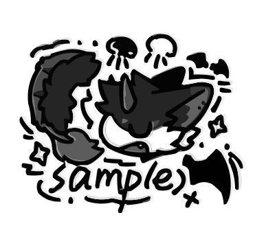

# ABKQPO

> 🖖 Minecraft Fan

---

## 🎓 About Me

I am **ABKQPO**, a passionate amateur developer who often develops random content

### 💼 Current Role
- **Active Member** at [GTNewHorizons](https://github.com/GTNewHorizons) community
- Contributing to innovative modding projects and open-source initiatives

---

## 🛠️ Technology Stack

### Languages

### Tools & Frameworks

---

## 🎯 Featured Projects

I'm actively contributing to these flagship repositories:

	

	

	

	

---

## 📊 Recent Activity & Statistics

### GitHub Overview

 

  
  

### Activity Graph

	

### Streak & Top Languages

	
	

---

	<i>⭐ If you find my work interesting, consider giving it a star! It helps me grow and motivates me to contribute more.</i>

	

